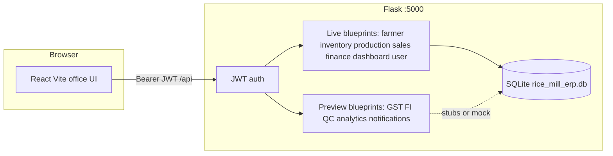
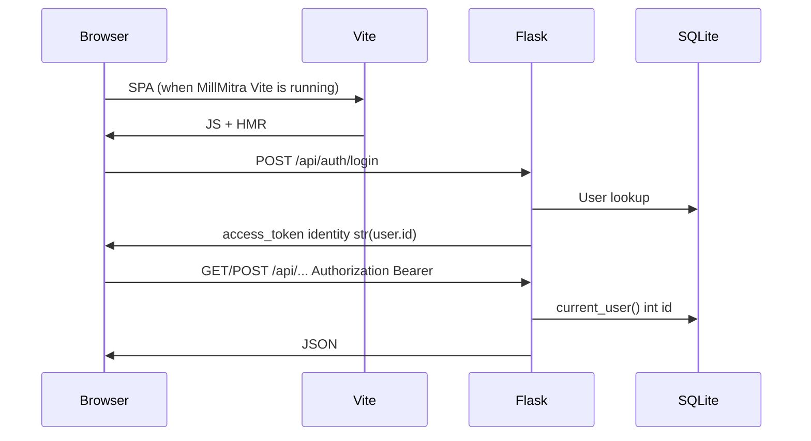

# MillMitra remediation report

**Historical snapshot** (3 October 2026). For the product as it works **now**, use [README.md](../README.md), [USER_GUIDE.md](USER_GUIDE.md), [BUSINESS.md](BUSINESS.md), and [TECHNICAL.md](TECHNICAL.md). Several items below are outdated (roles now server-enforced; preview pages default to live mill records; `/api/users` and `/api/access` exist; six demo personas).

Date: 3 October 2026. Scope: `D:\GenAi\millmitra` repo plus what was reachable on this machine. This pass **implemented** fixes; it is not analysis-only.

Prior work left in place: inventory selects, sales orders, dashboard widgets, finance stock deduct, JWT `str(user.id)` + `current_user()`, PWA/SW dev unregister, GST preview buttons, `/api/health` + `/api/ready`, PageChrome.

No commit. User Flask/Vite processes were not killed or restarted.

---

## Executive summary

`http://localhost:3000/` is **not MillMitra**. The open browser tab is **ClearTitle - Enterprise Legal OS** (`http://127.0.0.1:3000/admin/access`). A GET of `/` on :3000 returned **404**. Vite for MillMitra is **not running**. The mill **API on :5000 is running** (`/api/health` and `/api/ready` both `ok`).

This pass locked unauthenticated notification APIs, stopped login from logging usernames/password checks, stopped logout from crashing when Redis is off, required a real customer and line items on invoices, stopped any payment from marking an invoice fully paid, and made OTP verification actually issue a JWT (only if an OTP was really sent). Frontend login no longer throws when the API asks for 2FA.

Validation: backend `compileall` OK; 7/7 `tests/test_remediation.py` passed; frontend eslint on touched files clean; `npm run build` succeeded. **Restart Flask** to load the backend changes (we did not bounce the user’s :5000 process).

---

## What localhost:3000 actually was

| Probe | Result |
| --- | --- |
| Browser tab | ClearTitle - Enterprise Legal OS, `/admin/access` |
| `GET http://localhost:3000/` | 404 |
| `:3001`, `:3002` | timeout (no MillMitra Vite) |
| `GET http://localhost:5000/api/health` | 200 liveness `ok` |
| `GET http://localhost:5000/api/ready` | 200 database `ok` |

Open the URL Vite prints after `cd frontend && npm run dev`. Do not start a second Vite on 3000 while ClearTitle holds it.

---

## Feature table (after this pass)

| Feature | Live or preview | UI | API | Status after this pass |
| --- | --- | --- | --- | --- |
| Login (password) | Live | `Login.jsx` | `POST /api/auth/login` | Live. Debug prints removed. Voice/biometric return 501. 2FA only if OTP send succeeds; verify issues JWT |
| Dashboard | Live | `Dashboard.jsx` | `/api/dashboard/*` | Unchanged (prior widget/customize work kept) |
| Farmers | Live | `Farmers.jsx` | `/api/farmer/*` | Unchanged; verify still admin/manager |
| Inventory | Live | `Inventory.jsx` | `/paddy`, `/products`, `/transactions` | Unchanged (selects, movements, stock card menus kept) |
| Production | Live | `Production.jsx` | `/api/production/batches*` | Unchanged lifecycle |
| Sales orders | Live | `Sales.jsx` | `/api/sales/orders` | Unchanged; `customer_id` required |
| Customers | Live | `Customers.jsx` | `/api/customers`, `/api/sales/customers` | Unchanged |
| Finance invoices/payments | Live | `Finance.jsx` | `/api/finance/invoices`, `/payments` | Invoice requires customer + line; payment no longer auto-`paid` for any amount |
| Settings / profile | Live | `Settings.jsx`, `ProfilePanel` | `/api/user/*` | Unchanged; 2FA enable still 501 |
| Notifications | Preview data | `Notifications.jsx` | `/api/notifications` | **Now JWT-required** (was open) |
| Analytics / QC / FI / GST | Preview | Sidebar Preview | Matching preview blueprints | GST/preview buttons kept; not mill-of-record |
| PWA / service worker | Prod only | `usePWA.js`, `sw.js` | n/a | Dev still unregisters SW (prior fix) |
| Voice login / biometric | Experimental | Login tabs | `/voice-login`, biometric | Labeled; password path does not pretend they work |

---

## Issue register

| ID | Sev | Problem | Root cause | Fix or why not | Validation |
| --- | --- | --- | --- | --- | --- |
| P0-001 | P0 | Anyone could GET/POST/DELETE `/api/notifications` | Routes had no `@jwt_required` | Added JWT to all notification routes | Tests: unauth GET/POST/DELETE → 401 |
| P0-002 | P0 | Login logged username and whether the password matched | `print` debug in `auth.py` | Removed; failures return generic 401 | compile + login path review |
| P1-001 | P1 | Logout without session token could 500 | `invalidate_user_sessions` called `self.redis_client.delete` when Redis is None; JWT id passed as string | Guard Redis; `int(user_id)` / `current_user_id()` | Code review; no crash path |
| P1-002 | P1 | Invoice without `customer_id` or lines persisted | Create accepted empty body | Require customer exists + one qty line; 401 if JWT user missing | Test: token + no customer → 400 |
| P1-003 | P1 | Any payment marked invoice `paid` | `Invoice.query.get` + unconditional `status='paid'` | Parse int id; `paid` only if amount ≥ total, else `partial` | Unit tests on `payment_status_for_amount` |
| P1-004 | P1 | 2FA dialog could not finish login | `authService.login` threw if no token; `verify-otp` returned `{verified}` only; `complete-login` does not exist | Return `requires_2fa` from login; verify issues JWT; UI stores token | eslint Login + authService |
| P1-005 | P1 | Password login accepted `method=voice/biometric` | Same `/login` branch | Those methods return **501** (use Password tab) | Code review |
| P2-001 | P2 | Console “Notifications loaded…” | `notificationService` `console.log` | Removed | eslint |
| P2-002 | P2 | Invoice stock match is fuzzy name | `_find_product_stock` ilike | **Not auto-fixed** — requiring `product_stock_id` is a business rule | Documented |
| P2-003 | P2 | Any role can invoice/pay/start batches | Almost no role checks | **REQUIRES BUSINESS DECISION** | Farmer verify already admin/manager |
| P2-004 | P2 | Seed `admin` / `admin123` | `migrate_db.py` | **REQUIRES BUSINESS DECISION** on a real mill PC | Documented in README |
| P2-005 | P2 | Partial payments not accumulated | No `paid_amount` column | Status `partial` for this payment only; full ledger is a decision | Helper tests |
| P3-001 | P3 | `datetime.utcnow` deprecation warnings | Flask helpers | Not changed (noise, not a defect) | Observed in tests |
| P3-002 | P3 | Extension “message channel closed” | Browser extension | Not MillMitra | Prior PWA pass |
| EXT-001 | — | :3000 is ClearTitle | Port conflict | Do not bind a second Vite to 3000 | Probe + browser tab |

---

## Files changed and before/after

| File | Before | After |
| --- | --- | --- |
| `backend/routes/notifications.py` | Open mock CRUD | JWT on every route |
| `backend/routes/auth.py` | Debug prints; 2FA even if OTP send failed; verify no JWT; voice/biometric on `/login` | Quiet login; 2FA only if OTP sent; verify issues token; voice/biometric 501 on `/login` |
| `backend/routes/finance.py` | Empty invoice OK; any payment → paid | Customer + line required; parse invoice id; paid/partial/pending |
| `backend/services/session_manager.py` | Redis `.delete` without client; string user id | Redis guarded; int user id |
| `frontend/src/services/authService.js` | Login threw on 2FA; OTP did not store token | Returns `requires_2fa`; OTP stores JWT |
| `frontend/src/pages/Login.jsx` | Called missing `complete-login` | Uses verify-otp token |
| `frontend/src/services/notificationService.js` | Console logs | Quiet |
| `backend/tests/test_remediation.py` | — | 7 regression tests |
| `docs/REMEDIATION_REPORT.md` | — | This file |

Unchanged on purpose (kept): ComplianceGST preview, PWA dev unregister, inventory/sales/dashboard prior fixes.

---

## Architecture (observed)





On this machine the first hop is **ClearTitle on :3000**, not Vite. The Flask hop is live.

---

## Validation commands and results

```text
backend: python -m compileall  → COMPILE_OK
backend: test_client /api/health → 200 ok
backend: test_client /api/ready  → 200 database ok
backend: python tests/test_remediation.py → Ran 7 tests OK
  - notifications 401
  - invoice POST 401 without JWT
  - invoice POST 400 without customer_id (seed user token)
  - parse_invoice_id / payment_status_for_amount
frontend: npx eslint Login.jsx authService.js notificationService.js → clean
frontend: npm run build → succeeded (~25s)
```

Browser click-through of MillMitra: **not done**. :3000 is ClearTitle; MillMitra Vite is not running. Did not start a competing server.

Running Flask on :5000 still serves **old** bytecode until the user restarts `python app.py`.

---

## Remaining debt and REQUIRES BUSINESS DECISION

- **Roles:** operator vs manager vs admin on invoices, payments, batch complete. Farmer verify is already gated.
- **Seed passwords:** change on any real mill PC.
- **Invoice lines:** require explicit `product_stock_id` vs fuzzy name match (wrong lot can be deducted).
- **Payments:** add `paid_amount` / allocation table if partials must sum across receipts.
- **2FA / TOTP:** OTP email/SMS is not a mill mailer. We only skip 2FA when send fails; we do not invent TOTP.
- **Notifications:** still in-memory mock after login. Not mill-of-record.
- **Preview AI screens:** keep labeled; no new AI.
- **`models.py` vs `models/`:** legacy re-export; do not treat as source of truth.
- **SQLAlchemy `Query.get` deprecation:** cleanup later, not a functional bug.

---

## Enhancement backlog (not bugs)

- Persist notifications in SQLite.
- Invoice line picker bound to product lots (once stock-id rule is decided).
- Payment allocations / receipts PDF.
- Vite default port that is not 3000 on this PC (avoids ClearTitle).
- Replace `datetime.utcnow` with timezone-aware UTC.
- Frontend unit-test script (package.json has none).

---

## What you should do

1. Restart Flask (`backend` venv, `python app.py`) so notification JWT and invoice/payment rules load.
2. Start MillMitra Vite and open the **printed** URL, not ClearTitle on :3000.
3. Hard-refresh once if an old service worker still controls localhost (dev now unregisters it).
4. Decide the business items above before we tighten roles or stock-id rules.
