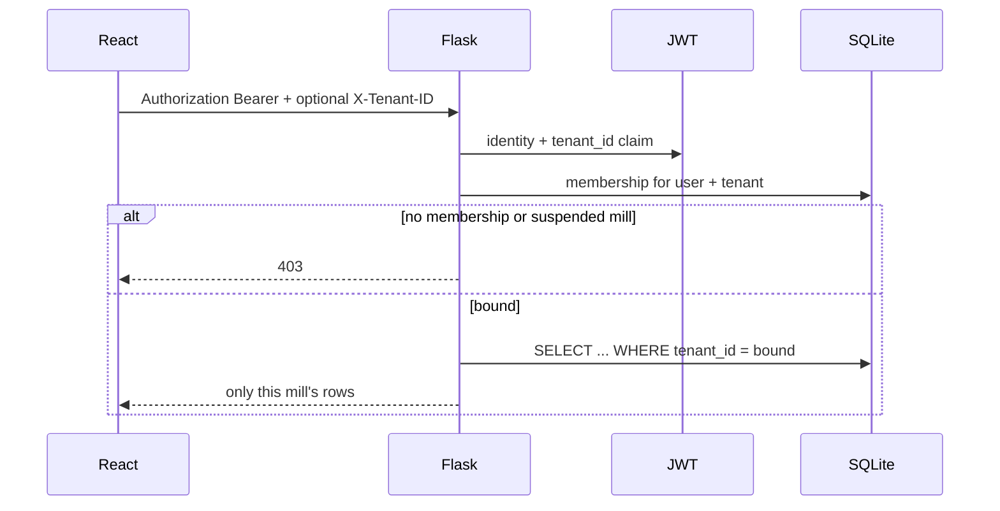

# MillMitra multi-tenant foundation

Shared database, shared schema, `tenant_id` on mill-owned tables (Model A). This is not Kubernetes, not an API gateway, and not Postgres RLS. SQLite stays the default.

**How to add or switch a mill:** [USER_GUIDE §4.6–4.7](USER_GUIDE.md#46-add-a-mill-tenant). This file is architecture only.

## As-is (before this pass)

One mill in one SQLite file. Users, farmers, stock, batches, invoices, lookups, and settings were global. Demo logins (`admin` / `admin123` and siblings) owned the whole database.

## Target

Every mill is a `Tenant`. People stay in `users`. `TenantMembership` says which mill they work in and which role they have there. JWT carries `tenant_id`. Queries for mill data always filter that id. A get-by-id without the tenant filter is treated as a bug.

Postgres row-level security is a later hardening step, not claimed here.

## What is implemented

- Tables `tenants` and `tenant_memberships`.
- `User.is_platform_admin` (default false). Existing users are not wiped.
- Startup migration (`services/tenant_migration.py`): add `tenant_id` if missing, create slug `default`, backfill existing rows, give every current user a membership with their current role, index `tenant_id`.
- Default mill name comes from mill settings `business.companyName`, else `MillMitra`.
- After login, JWT includes `tenant_id`. `X-Tenant-ID` is honored only if that user is a member of that mill.
- Suspended mill: members get 403 on mill APIs (`/api/tenants` and `/api/auth/me` still work).
- Lookups and `role_permissions` are per tenant.
- Users / Access lists are this mill only.
- `POST /api/tenants` creates a mill + owner (idempotent on slug).
- `GET /api/tenants/mine` and `POST /api/tenants/{id}/switch` re-issue JWT.
- Navbar shows the mill name. More than one membership shows a switcher that replaces the token and clears react-query cache.

## Request flow



## Tables scoped with `tenant_id`

farmers, farmer_contracts, paddy_procurements, farmer_edit_requests, paddy_stock, product_stock, stock_movements, production_batches, quality_tests, customers, sales_orders, invoices, payments, payment_schedules, expenses, transactions, notifications, lookup_options, mill_config, gst_filing_records, saved_reports, role_permissions.

Users remain global. Membership is the mill link.

## Migration

On Flask start: `db.create_all()` then `migrate_tenant_schema()`. ALTER is skipped when the column already exists. Nothing is dropped. After restart, `admin` / `admin123` still signs into slug `default`.

## Tests run

```
cd backend
.\venv\Scripts\python.exe -m unittest tests.test_tenancy -v
```

- Demo admin lands on `default`.
- Tenant A lists only its farmer; GET of tenant B's farmer id is 404.
- Lookup option created on B is invisible to A.

## How to add and maintain a mill

Operator and API steps live in the product docs — do not treat this file as the how-to:

- [USER_GUIDE — Add a mill (tenant)](USER_GUIDE.md#46-add-a-mill-tenant) and [Switch mill](USER_GUIDE.md#47-switch-mill)
- [README — Tenants](../README.md#tenants-more-than-one-mill)
- [TECHNICAL — Tenants](TECHNICAL.md#tenants-apitenants)

Restart Flask with the millmitra venv (stop the old window yourself):

```
cd D:\GenAi\millmitra\backend
.\venv\Scripts\python.exe app.py
```

## Not built (P2)

Custom domain / white-label theme engine, SSO IdP, Stripe billing, dedicated database per mill, Kafka, Elasticsearch, OpenTelemetry SDKs, API gateway, vector DB, Postgres RLS policies.
